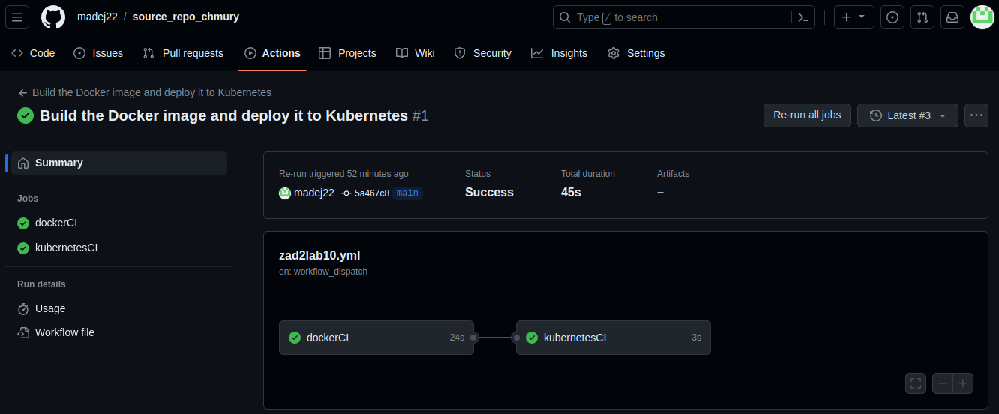

# Zadanie 2
## Programowanie Full-Stack w Chmurze Obliczeniowej
## Kacper Madejczyk, 92937

### Krótki opis
Repozytorium zawiera plik źródłowy aplikacji oraz plik Dockerfile służący do budowania obrazu. Został tutaj zdefiniowany również łańcuch zadań GitHub Actions służący do generowania nowej wersji obrazu dockerowego aplikacji. W celu wygenerowania nowej wersji, należy najpierw zmienić wartość zmiennej środowiskowej `APPVER` i uruchomić łańcuch widoczny na zrzucie ekranu poniżej.

[Link do obrazu na DockerHub](https://hub.docker.com/repository/docker/madej22/chmury_z2_image/general)

Manifesty Kubernetes znajdują się w [drugim repozytorium](https://github.com/madej22/config_repo_chmury).

